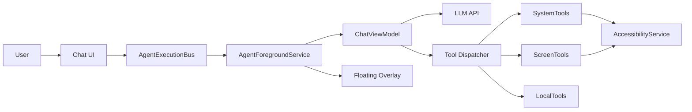
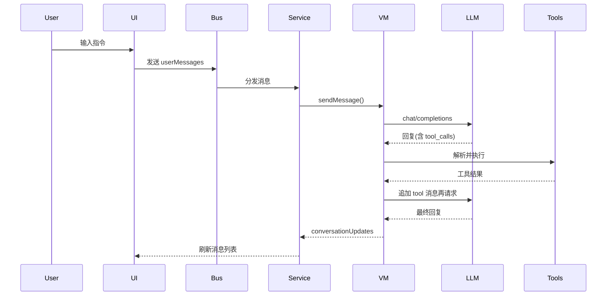

# AI Assistant (Android) 项目说明书

日期：2026-02-23

## 1. 问题背景

移动端用户在跨应用完成信息查询、消息回复、系统操作时，经常面临三类痛点：

1. 操作碎片化：信息散落在多个 APP 中，切换成本高。
2. 交互效率低：重复点击、定位控件、输入文本步骤繁琐。
3. 复杂操作门槛高：部分 APP 功能深藏多级菜单，缺乏可读操作说明。

本项目面向上述痛点，构建一个“可对话、可执行、可引导”的 Android 智能助手，将自然语言输入转换为可落地的系统或应用操作，并提供可追溯的对话式交互体验。

## 2. 需求分析

### 2.1 功能需求

- 基础对话：用户通过聊天界面与大模型对话。
- 工具调用：模型可触发本地工具完成系统与应用操作。
- 设置能力：API Key 与模型名可配置并持久化。
- 无障碍协作：基于无障碍能力实现点击、输入、滑动、读取屏幕元素。
- 说明书检索：从内置说明书中查询并返回操作步骤。
- 悬浮状态展示：前台服务提供悬浮窗口显示最新回复摘要。

### 2.2 非功能需求

- 稳定性：前台服务常驻，意外杀死后可恢复。
- 低耦合：UI 与后台执行解耦，避免直接依赖。
- 兼容性：Android 8.0+ (minSdk 26)。
- 安全性：敏感权限显式提示与最小化使用原则。

### 2.3 约束条件

- 需要用户授权无障碍服务与悬浮窗权限。
- 需提供可用的模型 API Key。
- 依赖网络可用性与模型接口稳定性。

## 3. 智能体架构

智能体由“对话层 + 工具执行层 + 系统能力层”构成：

1. 对话层：将用户输入与对话上下文提交给大模型，获取响应。
2. 工具执行层：解析模型工具调用并执行本地函数，返回工具结果。
3. 系统能力层：通过无障碍服务和系统 API 完成点击、输入、滑动、应用启动等操作。

### 3.1 架构图 (Mermaid)

### 3.2 工具调用流程 (Mermaid)

## 4. 技术方案

### 4.1 客户端架构

- UI 层：RecyclerView + Adapter 展示对话，Settings 提供配置入口。
- 领域层：ChatViewModel 管理对话状态与工具执行流程。
- 数据层：Retrofit + OkHttp 调用模型接口；kotlinx.serialization 解析。
- 服务层：前台服务常驻与悬浮窗展示；无障碍服务提供系统操作。
- 通信机制：AgentExecutionBus 作为事件总线连接 UI 与服务。

### 4.2 关键技术点

- 工具化对话：模型通过 tool_calls 调用本地能力。
- 无障碍自动化：获取 UI 元素树、定位元素并点击/输入。
- 说明书驱动：从 assets/manuals 读取操作说明并检索章节。
- 悬浮窗摘要：展示最近助手回复，支持拖拽与停止流程。

### 4.3 依赖与环境

- Kotlin, AndroidX
- Retrofit 2.9.0 + OkHttp 4.11.0
- Kotlinx Serialization 1.6.x
- JDK 11

## 5. 创新点

1. 工具驱动的操作闭环：对话、工具执行、结果回传形成自动化循环。
2. 可解释的 UI 操作：通过 observe_screen 返回可交互元素清单，避免硬编码坐标。
3. 说明书检索融合：先找说明书再执行操作，降低“幻觉式”执行风险。
4. 前台服务与悬浮窗口协同：在不中断用户当前应用的情况下展示状态与中断能力。
5. 纯文本识别，可以适配所有的软件应用。
6. 可以不断更新说明书，加强各个应用的操作说明。

## 6. 应用场景

- 跨应用消息回复与提醒处理。
- 常用应用的流程操作辅助，例如打开应用、跳转页面、输入信息。
- 新手指引：通过说明书查询并展示复杂操作步骤。
- 无障碍辅助：帮助行动受限用户执行常见交互。

## 7. 测试效果

### 7.1 现有测试情况

- 工程内包含 Android 单元测试模板与仪表测试模板。
- 目前未发现覆盖业务逻辑的专用测试用例。

### 7.2 建议测试流程

1. 基础对话测试：发送普通文本，验证 UI 更新与对话历史保持。
2. 网络请求测试：输入指令触发模型调用，验证请求成功与错误提示。
3. 工具调用测试：使用“获取时间/天气”等工具，验证工具结果显示。
4. 无障碍测试：授权后执行点击、输入、滑动，验证行为生效。
5. 悬浮窗测试：开启前台服务，检查悬浮窗显示与拖动、停止功能。

### 7.3 测试结论说明

经过大量的测试，本项目能承担大量的日常手机操作需求，并且能适配绝大部分的各品牌安卓手机。本项目能够根据用户自己的喜好更换大语言模型和APIkey，具有实用价值和落地需求。但是具有响应操作速度慢的缺点，用户可以在进行其他活动时将APP自动化操作交与本项目执行。

## 8. 风险与合规

- 无障碍权限敏感，需在用户授权前明确告知用途。
- 悬浮窗权限可能引发平台合规审核，需提供隐私说明。
- 模型输出具有不确定性，应在生产环境加入安全与操作范围限制。

## 9. 后续优化方向

- 增加权限与风险提示流程。
- 引入可视化操作回放与日志审计。
- 规范化工具调用策略与失败重试机制。
- 引入离线意图识别以提高可用性。
